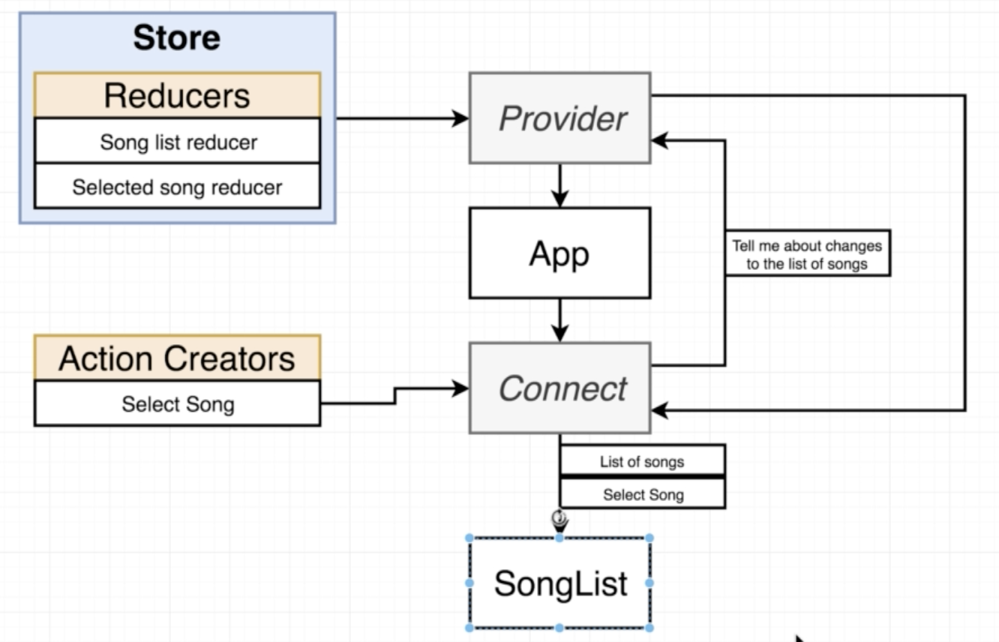
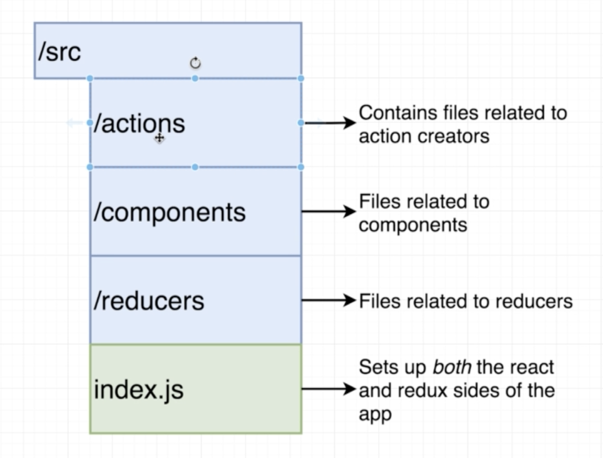

# REACT NOTES

## REDUX Analogy

Comparing the Redux cycle to the Insurance policy analogy

Action Creator -> Action -> Dispatch -> Reducers -> State

Person dropping off the form (Action Creator) ->
The Form (Action) ->
Form Receiver (Dispatch) ->
Departments (Reducers) ->
Compiled Department Data (State)

```JavaScript
// clears any console.log when a chnage is made in the code that updates the page
console.clear();


// 3 ACTION CREATORS

// Action Creator - People dropping off a form
const createPolicy = (name, amount) => {
  return { // Action: a form in analogy
    type: 'CREATE_POLICY',
    payload: {
      name: name,
      amount: amount
    }
  };
};

const deletePolicy = (name) => {
  return { // Action: a form in analogy
    type: 'DELETE_POLICY',
    payload: {
      name: name
    }
  };
};

const createClaim = (name, amountOfMoneyToCollect) => {
  return { // Action: a form in analogy
    type: 'CREATE_CLAIM',
    payload: {
      name: name,
      amountOfMoneyToCollect: amountOfMoneyToCollect
    }
  };
};


// 3 REDUCERS (Departments)

// If someone makes a call with an oldListOfClaims of undefined, then the var will be replaced with an empty arr
const claimHistory = (oldListOfClaims = [], action) => {  
  if (action.type === 'CREATE_CLAIM') {
    // ES2016 syntax:
    /*
    EXPLANATION:
    const arr = [1, 2, 3];
    [...arr, 4]
    >>> [1, 2, 3, 4]

    In reducers, when we want to make a change, we always want to create a new array
    NOT push into an existing one
    */
    return [...oldListOfClaims, action.payload];
  }
  return oldListOfClaims;
};

const accounting = (bagOfMoney=100, action)=>{
  if(action.type=== 'CREATE_CLAIM'){
    return bagOfMoney - action.payload.amountOfMoneyToCollect;
  }else if(action.type=== 'CREATE_POLICY'){
    return bagOfMoney + action.payload.amount;
  }
  return bagOfMoney;

};

const policies = (listOfPolicies = [], action)=>{
  if(action.type === 'CREATE_POLICY'){
    return [...listOfPolicies, action.payload.name];
  }else if( action.type === 'DELETE_POLICY'){
    return listOfPolicies.filter( name => name !==       action.payload.name);
  }
  return listOfPolicies;
};
```


```javascript
// incorporating the Redux to the function
console.log(Redux);

const { createStore, combineReducers } = Redux;

const ourDepartments = combineReducers({
  accounting: accounting,
  claimHistory:claimHistory,
  policies: policies
});


const store = createStore(ourDepartments);


store.dispatch(createPolicy('Emerson',40));
store.dispatch(createPolicy('Lee',10));
store.dispatch(createPolicy('Julia',50));

store.dispatch(createClaim('Julia',50));
store.dispatch(createClaim('Julia',20));

store.dispatch(deletePolicy('Lee'));

console.log(store.getState());
```

## SONGS FLOWCHART






## REACT-REDUX EXERCISE 

```html
<script type="text/babel" data-plugins="proposal-class-properties" data-presets="env,react">
    // Action Creators - You don't need to change these
    const increment = () => ({ type: 'increment' });
    const decrement = () => ({ type: 'decrement' });

    const Counter = (props) => {
        return (
            <div>
                <button onClick={props.increment} className="increment">Increment</button>
                <button onClick={props.decrement} className="decrement">Decrement</button>
                Current Count: <span>{ props.count}</span>
            </div>
        );
    };

    const mapStateToProps = (state) => {
        return { count: state.count };
    };

    const WrappedCounter = ReactRedux.connect(mapStateToProps,{
        increment: increment,
        decrement: decrement
    })(Counter);

    // Only change code *before* me!
    // -----------

    const store = Redux.createStore(Redux.combineReducers({
        count: (count = 0, action) => {
            if (action.type === 'increment') {
                return count + 1;
            } else if (action.type === 'decrement') {
                return count - 1;
            } else {
                return count;
            }
        }
    }));

    ReactDOM.render(
        <ReactRedux.Provider store={store}>
            <WrappedCounter />
        </ReactRedux.Provider>,
        document.querySelector('#root')
    );
</script>


<!--The App component above will be rendered into this-->
<div id="root"></div>


<!--No need to change anything after this line!-->
<!--No need to change anything after this line!-->
<script crossorigin src="https://cdnjs.cloudflare.com/ajax/libs/babel-polyfill/7.0.0/polyfill.min.js"></script>
<script crossorigin src="https://unpkg.com/@babel/standalone/babel.min.js"></script>
<script crossorigin src="https://unpkg.com/@babel/preset-env-standalone@7/babel-preset-env.min.js"></script>
<script crossorigin src="https://unpkg.com/react@16/umd/react.production.min.js"></script>
<script crossorigin src="https://unpkg.com/react-dom@16/umd/react-dom.production.min.js"></script>
<script crossorigin src="https://unpkg.com/redux@4.0.1/dist/redux.js"></script>
<script crossorigin src="https://unpkg.com/react-redux@5.0.6/dist/react-redux.js"></script>

<link rel="stylesheet" href="https://cdnjs.cloudflare.com/ajax/libs/semantic-ui/2.4.1/semantic.min.css" />
```
